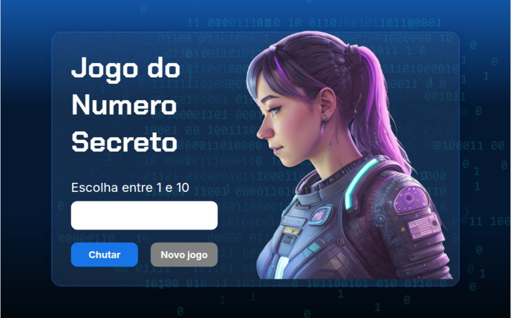

# Jogo de Adivinhação do Número Secreto

Este é um jogo simples e divertido de adivinhação, desenvolvido como parte da aula **Programação G8** no programa **ONE (Oracle Next Education)** da **Alura**. O objetivo do jogo é tentar adivinhar o número secreto gerado aleatoriamente pelo sistema.

---

## ✨ Tecnologias Utilizadas
- **HTML**: Estrutura da página.
- **CSS**: Estilização do layout.
- **JavaScript**: Lógica do jogo e interação com o usuário.

---

## 🎮 Como Jogar
1. O sistema gera um número secreto aleatório dentro de um intervalo definido.
2. O jogador tenta adivinhar o número inserindo valores.
3. O sistema fornece feedback indicando se o número inserido é **maior**, **menor** ou **igual** ao número secreto.
4. Continue jogando até acertar o número!

---

## 🕹️ Jogar Online
[Clique aqui para jogar online!](https://jogo-henna-phi-76.vercel.app/)

---

Desenvolvido com  durante a jornada do programa ONE (Oracle Next Education) da Alura.
